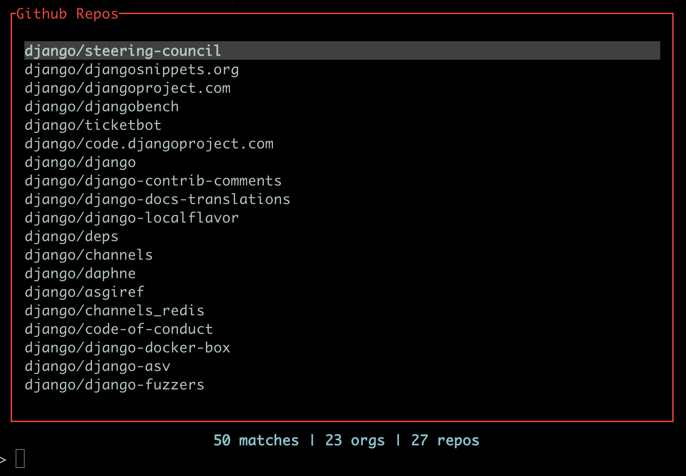

# gg

A fast, keyboard-driven GitHub CLI tool.

## Features

- **TUI Fuzzy Finder** - Quickly search and browse your GitHub repositories and organizations from the terminal
- **Local Caching** - SQLite database stores GitHub data with usage tracking for smart scoring
- **Quick Navigation** - Open GitHub pages directly from your git repository (issues, actions, settings, milestones)
- **GitHub Actions Monitoring** - Watch running or recent GitHub Actions for the current repo/branch

## Installation

```bash
cargo install gg-github
```

Or download a pre-built binary for your OS from [our releases](https://github.com/frankwiles/gg/releases). 

## Configuration

Set your GitHub Personal Access Token:

```bash
export GITHUB_TOKEN="ghp_..."
```

Or use the `--token` flag with any command.

## Usage

### Global Options

| Option | Description |
|--------|-------------|
| `--token <TOKEN>` | GitHub Personal Access Token (overrides `GITHUB_TOKEN` env var) |
| `-q, --quiet` | Suppress progress indicators and non-error output |

### TUI



### Commands

#### `gg` (default)

Launches the TUI fuzzy finder for browsing cached repositories.

#### `gg tui`

Explicitly launch the TUI fuzzy finder.

#### `gg data <action>`

Data management commands.

| Action | Description |
|--------|-------------|
| `refresh` | Refresh all orgs and repos from GitHub API |
| `clear` | Clear local cache |
| `status` | Show cache statistics |
| `export` | Export cached data as JSON to stdout |
| `reveal` | Show the database file path |

```bash
gg data refresh
gg data status
gg data clear
gg data export
gg data reveal
```

#### `gg issues`

Open the current repository's Issues page in your browser.

#### `gg actions`

Open the current repository's Actions page in your browser.

#### `gg settings`

Open the current repository's Settings page in your browser.

#### `gg milestones`

Open the current repository's Milestones page in your browser.

#### `gg watch action`

Open the currently running or most recently completed Github Action for the 
current branch. 

```bash
gg watch action
```

#### `gg raycast <action>`

TODO: Raycast extension integration.

| Action | Description |
|--------|-------------|
| `list-repos` | Return list of repos for Raycast to display |
| `open <target>` | Open repo/org URL |
| `open-view <target> -v <view>` | Open specific view for repo |

## License

MIT

## Author 

[Frank Wiles](https://frankwiles.com) 
